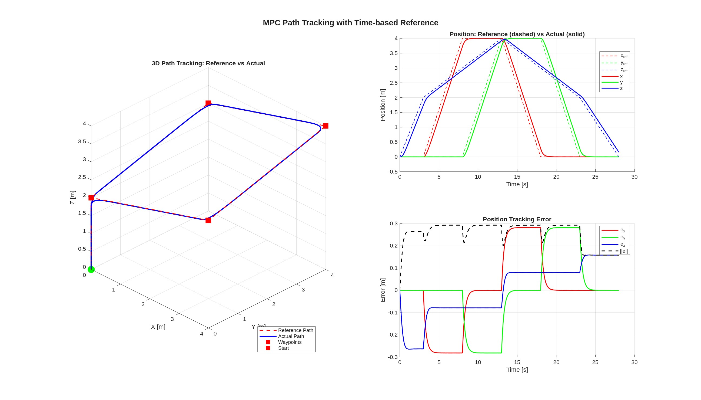
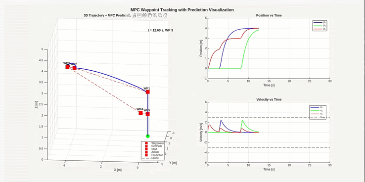

# MPC Tracking Guide

Linear MPC를 사용한 쿼드콥터 경로 추종에 대한 개념 정리.

---

## 1. Waypoint Tracking vs Path Tracking

### 차이점 비교

| 특성 | Waypoint Tracking | Path Tracking |
|-----|-------------------|---------------|
| **목표** | 점(waypoint)들에 도달 | 연속 경로를 따라감 |
| **전환 조건** | 거리 기반 (도달하면 다음) | 시간 기반 (매 스텝 참조) |
| **중간 경로** | 자유 (어떻게 가든 OK) | 정확히 따라야 함 |
| **속도 프로파일** | 없음 | 있음 (시간에 따른 속도) |
| **구현 복잡도** | 간단 | 복잡 |

### Waypoint Tracking

```python
if distance_to_waypoint < threshold:
    current_waypoint = next_waypoint
```

**"도달하면 다음"** - 시간 무관, 경로 자유

### Path Tracking (등시간 리샘플링)

```python
x_ref = path[current_time]  # 매 스텝 시간 기반 참조
```

**"이 시간에 여기 있어야 함"** - 시간 기반, 경로 구속

> Path Following은 Path Tracking과 차이가 있음
>> Path *Following*
오차: 기하학적 거리만 $$e = \text{distance}(\text{vehicle}, \text{path})$$
>> Path *Tracking*
오차: 시간 동기화된 참조점과의 거리 $$e(t) = \text{vehicle}(t) - \text{reference}(t)$$

---

## 2. Path Tracking 구현

### 2.1 경로 정의

Waypoint와 도달 시간을 함께 정의:

```matlab
path_waypoints = [
%   x    y    z    도달시간[s]
    0,   0,   0,   0;      
    0,   0,   2,   3;      % 상승 (3초)
    4,   0,   2,   8;      % 앞으로 (5초)
    ...
];
```

### 2.2 등시간 리샘플링

각 시간 $t$에 대해 선형 보간:

```math
\mathbf{p}_{ref}(t) = (1 - \alpha) \cdot \mathbf{p}_{start} + \alpha \cdot \mathbf{p}_{end}
```

여기서:
```math
\alpha = \frac{t - t_{start}}{t_{end} - t_{start}}
```

속도 참조 계산:
```math
\mathbf{v}_{ref} = \frac{\mathbf{p}_{end} - \mathbf{p}_{start}}{t_{end} - t_{start}}
```

### 2.3 MPC 참조 상태

```math
\mathbf{x}_{ref}(t) = \begin{bmatrix} \mathbf{p}_{ref}(t) \\ \mathbf{v}_{ref}(t) \end{bmatrix}
```

---

## 3. 시뮬레이션 결과
### Path Tracking 결과



**성능 지표:**

| 지표 | 값 |
|-----|-----|
| RMSE (x) | 0.1628 m |
| RMSE (y) | 0.1628 m |
| RMSE (z) | 0.1628 m |
| RMSE (total) | 0.2618 m |
| 최대 오차 | 0.2924 m |
| 최종 오차 | 0.1580 m |

### 오차 분석

- **지연 오차**: MPC가 부드러운 움직임 우선 → 참조보다 약간 뒤처짐
- **코너 오차**: 방향 전환 시 오차 피크 발생
- **쿼드콥터 특성**: Underactuated system → 완벽한 직선 추종 어려움

---

### Waypoint Tracking 결과



**곡선 형태의 경로가 발생하는 이유:**

| 요인 | 설명 |
|-----|------|
| **참조 방식** | 목적지(Waypoint)만 아는 상태 → **중간 경로 자유** |
| **비용 함수** | 입력(R) 최소화 → **부드러운 곡선이 효율적** |
| **속도 제약** | 급격한 방향 전환 불가 → **자연스러운 곡선** |

즉, Energy-efficient trajectory 또는 Cost-optimal trajectory의 형태임.

> Path Tracking처럼 직선 경로가 필요하면 Waypoint 사이에 **중간 참조점을 촘촘히 생성** 하거나 **시간 기반 참조**를 사용해야 함.

---

## 4. 파라미터 튜닝

### Q, R 행렬 설정

**Q (상태 가중치)**:
```math
Q = \text{diag}([q_{px}, q_{py}, q_{pz}, q_{vx}, q_{vy}, q_{vz}])
```

**R (입력 가중치)**:
```math
R = \text{diag}([r_{\phi}, r_{\theta}, r_{\Delta T}])
```

### 튜닝 가이드

| 증상 | 해결 방법 |
|-----|----------|
| 추종 오차 크다 | Q 위치 가중치 ↑ |
| 반응이 느리다 | Q 속도 가중치 ↓, R ↓ |
| 진동/오버슈트 | R ↑, Q 속도 ↑ |
| 제약에 자주 걸림 | Q ↓ 또는 제약 완화 |

### 튜닝 전후 비교

| 설정 | Q 위치 | Q 속도 | R | RMSE |
|-----|--------|--------|---|------|
| 초기 | [10,10,20] | [10,10,10] | [1,1,0.1] | 0.327m |
| **튜닝 후** | [50,50,100] | [5,5,5] | [0.5,0.5,0.05] | **0.262m** |

---

## 5. 쿼드콥터 물리적 한계

### Underactuated System

```
입력: 4개 (T, φ, θ, ψ)
자유도: 6개 (x, y, z, φ, θ, ψ)
```

→ 입력 < 자유도 → 모든 방향 독립 제어 불가

### 이동 원리

| 이동 방향 | 필요한 자세 |
|----------|------------|
| +X (전진) | Pitch (θ > 0) |
| +Y (좌측) | Roll (φ < 0) |
| +Z (상승) | 추력 증가 |

**기울이면 → 수직 추력 성분 감소 → z도 영향받음**

```math
T_z = T \cdot \cos\phi \cdot \cos\theta
```

---

## 6. 다음 단계

- 상태 제약 추가 : 속도 제약 등 추가 필요
- Terminal Cost 추가 : 아래에 자세한 설명 적어놓음
- ROS2 구현

> **Terminal Cost**란?
>- 그냥 MPC의 경우에는 앞으로 몇 스텝동안만 고려 → 안정성 상대적으로 낮음

>- Terminal Cost 추가 : Final(Terminal) 상태에 대한 가중치를 추가하여 안정성 향상
>>- $Q_f$ (or $P$) 행렬 : Final(Terminal) 상태에 대한 가중치 행렬
>>- $Q_f$ = LQR(Linear Quadratic Regulator)의 Riccati Equation을 통해 계산
>>>- 무한 horizon 비용을 하나의 행렬로 압축
>>>- 즉, $N$ step 이후의 "미래 비용 예상치"