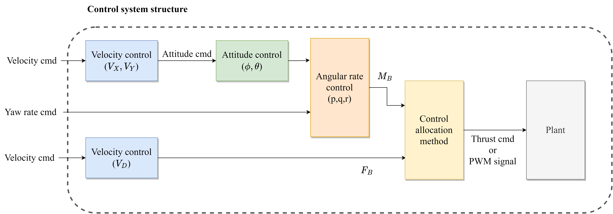
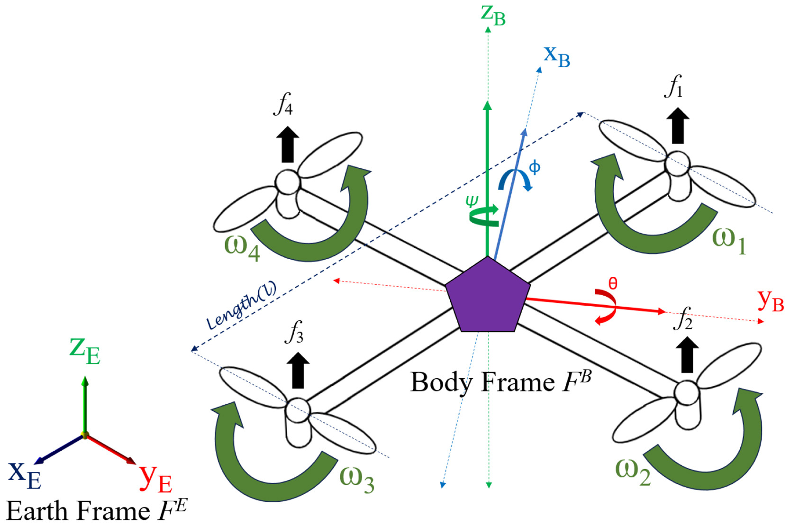

# Quadrotor Dynamics Model & Control System

이 문서는 쿼드콥터의 동역학 모델과 제어 시스템 구조를 설명함.

---

## 1. Control System Structure



### 제어 계층 구조

위 그림은 쿼드콥터 제어 시스템의 계층 구조를 보여줌:

1. **Velocity Control ($V_x$, $V_y$, $V_z$)**: 속도 명령을 받아 자세 명령 생성
2. **Attitude Control ($\phi$, $\theta$)**: 자세 명령을 받아 각속도 명령 생성
3. **Angular Rate Control ($p$, $q$, $r$)**: 각속도 명령을 받아 토크(M_B) 생성
4. **Control Allocation**: 힘/토크를 개별 모터 명령으로 변환
5. **Plant**: 실제 쿼드콥터 (Gazebo 또는 실제 기체)

---

## 2. PX4 Offboard Control Levels

PX4 Offboard 모드에서는 **어느 레벨에서 제어를 넘겨받을지** 선택할 수 있다.

### Level 1: Position Setpoint

```
ROS에서 발행: /fmu/in/trajectory_setpoint (position)
PX4가 처리: Position → Velocity → Attitude → Rate → Motor
```

- **사용 토픽**: `TrajectorySetpoint.position`
- **ROS에서 계산**: 목표 위치(x, y, z)만 지정
- **PX4가 처리**: 위치 제어부터 모터까지 전부

### Level 2: Velocity Setpoint

```
ROS에서 발행: /fmu/in/trajectory_setpoint (velocity)
PX4가 처리: Velocity → Attitude → Rate → Motor
```

- **사용 토픽**: `TrajectorySetpoint.velocity`
- **ROS에서 계산**: 목표 속도(vx, vy, vz)
- **PX4가 처리**: 속도 제어부터 모터까지
- **현재 LQR 컨트롤러가 사용 중**

### Level 3: Attitude Setpoint (우선 이걸로 예정)

```
ROS에서 발행: /fmu/in/vehicle_attitude_setpoint
PX4가 처리: Attitude → Rate → Motor
```

- **사용 토픽**: `VehicleAttitudeSetpoint`
- **ROS에서 계산**: 추력(T) + 목표 자세(quaternion)
- **PX4가 처리**: 자세 제어부터 모터까지
- **동역학 기반 제어(LQR, MPC)에 적합**

### Level 4: Rate Setpoint

```
ROS에서 발행: /fmu/in/vehicle_rates_setpoint
PX4가 처리: Rate → Motor
```

- **사용 토픽**: `VehicleRatesSetpoint`
- **ROS에서 계산**: 추력(T) + 목표 각속도(p, q, r)
- **PX4가 처리**: 각속도 제어 및 모터 믹싱

### Level 5: Actuator (Direct Motor Control)

```
ROS에서 발행: /fmu/in/actuator_motors
PX4가 처리: 신호 전달만 (믹서 포함)
```

- **사용 토픽**: `ActuatorMotors`
- **ROS에서 계산**: 개별 모터 추력(m1, m2, m3, m4)
- **PX4가 처리**: 거의 없음

### 레벨별 비교표

| Level | 발행 토픽 | ROS에서 계산 | PX4가 처리 | 난이도 |
|-------|----------|-------------|-----------|-------|
| 1. Position | `trajectory_setpoint` | 위치 목표 | 위치→모터 | ⭐ |
| 2. Velocity | `trajectory_setpoint` | 속도 명령 | 속도→모터 | ⭐⭐ |
| **3. Attitude** | `vehicle_attitude_setpoint` | **추력 + 자세** | 자세→모터 | ⭐⭐⭐ |
| 4. Rate | `vehicle_rates_setpoint` | 추력 + 각속도 | 각속도→모터 | ⭐⭐⭐⭐ |
| 5. Actuator | `actuator_motors` | 모터 추력 | 믹서만 | ⭐⭐⭐⭐⭐ |

---

## 3. Quadrotor Dynamics Model

### 3.1 좌표계 정의

- **World Frame (W)**: ENU (East-North-Up) 좌표계
- **Body Frame (B)**: FLU (Forward-Left-Up) 좌표계
- **x**: 기체 전방
- **y**: 기체 좌측
- **z**: 기체 상방

### 3.2 상태 벡터 (State Vector)

**전체 상태 (12차원):**

```math
\mathbf{x} = \left[\begin{array}{c} p_x \\ p_y \\ p_z \\ v_x \\ v_y \\ v_z \\ \phi \\ \theta \\ \psi \\ p \\ q \\ r \end{array}\right]
```

- $(p_x, p_y, p_z)$: 위치 (World Frame)
- $(v_x, v_y, v_z)$: 속도 (World Frame)
- $(\phi, \theta, \psi)$: 자세 (Roll, Pitch, Yaw)
- $(p, q, r)$: 각속도 (Body Frame)

**상위 제어기에서 사용하는 상태 (6차원):**

```math
\mathbf{x}_{pos} = \left[\begin{array}{c} p_x \\ p_y \\ p_z \\ v_x \\ v_y \\ v_z \end{array}\right]
```

### 3.3 입력 벡터 (Input Vector)

**Attitude Level 제어 시 입력:**

```math
\mathbf{u} = \left[\begin{array}{c} T \\ \phi_d \\ \theta_d \\ \psi_d \end{array}\right]
```

- $T$: 총 추력 (스칼라, Newton)
- $\phi_d$: 목표 Roll (rad)
- $\theta_d$: 목표 Pitch (rad)
- $\psi_d$: 목표 Yaw (rad)

### 3.4 비선형 동역학 방정식

#### 병진 운동 (Translational Dynamics)

Newton의 제2법칙 적용:

```math
m \ddot{\mathbf{p}} = \mathbf{R} \left[\begin{array}{c} 0 \\ 0 \\ T \end{array}\right] - \left[\begin{array}{c} 0 \\ 0 \\ mg \end{array}\right]
```

전개하면:

```math
\ddot{p}_x = \frac{T}{m} (\cos\psi \sin\theta \cos\phi + \sin\psi \sin\phi)
```

```math
\ddot{p}_y = \frac{T}{m} (\sin\psi \sin\theta \cos\phi - \cos\psi \sin\phi)
```

```math
\ddot{p}_z = \frac{T}{m} \cos\theta \cos\phi - g
```

#### 회전 운동 (Rotational Dynamics)

Euler 방정식:

```math
\mathbf{I} \dot{\boldsymbol{\omega}} = -\boldsymbol{\omega} \times (\mathbf{I} \boldsymbol{\omega}) + \boldsymbol{\tau}
```

여기서:
- $\mathbf{I}$: 관성 텐서 (Body Frame)
- $\boldsymbol{\omega} = [p, q, r]^T$: 각속도 (Body Frame)
- $\boldsymbol{\tau} = [\tau_x, \tau_y, \tau_z]^T$: 토크 (Body Frame)

### 3.5 선형화 모델 (Linearized Model)

Hover 상태 근방에서 작은 각도 가정 ($\sin\theta \approx \theta$, $\cos\theta \approx 1$):

```math
\ddot{p}_x \approx g \cdot \theta
```

```math
\ddot{p}_y \approx -g \cdot \phi
```

```math
\ddot{p}_z \approx \frac{T - mg}{m} = \frac{\Delta T}{m}
```

#### 상태공간 표현

```math
\dot{\mathbf{x}} = A\mathbf{x} + B\mathbf{u}
```

```math
A = \left[\begin{array}{cccccc}
0 & 0 & 0 & 1 & 0 & 0 \\
0 & 0 & 0 & 0 & 1 & 0 \\
0 & 0 & 0 & 0 & 0 & 1 \\
0 & 0 & 0 & 0 & 0 & 0 \\
0 & 0 & 0 & 0 & 0 & 0 \\
0 & 0 & 0 & 0 & 0 & 0
\end{array}\right]
```

```math
B = \left[\begin{array}{ccc}
0 & 0 & 0 \\
0 & 0 & 0 \\
0 & 0 & 0 \\
0 & g & 0 \\
-g & 0 & 0 \\
0 & 0 & \frac{1}{m}
\end{array}\right]
```

입력 벡터: $\mathbf{u} = [\phi_d, \theta_d, \Delta T]^T$

---

## 4. x500 기체 파라미터

### 4.1 물리 파라미터 (from Gazebo SDF)

| 파라미터 | 값 | 설명 | 출처 |
|---------|-----|------|------|
| $m$ | 2.0 kg | 기체 질량 | `x500_base/model.sdf` |
| $I_{xx}$ | 0.0217 kg·m² | Roll 관성 | `x500_base/model.sdf` |
| $I_{yy}$ | 0.0217 kg·m² | Pitch 관성 | `x500_base/model.sdf` |
| $I_{zz}$ | 0.0400 kg·m² | Yaw 관성 | `x500_base/model.sdf` |
| $g$ | 9.81 m/s² | 중력가속도 | 상수 |

### 4.2 모터 파라미터 (from Gazebo SDF)

| 파라미터 | 값 | 설명 |
|---------|-----|------|
| `motorConstant` ($k_f$) | 8.54858e-06 | 추력 계수: $T = k_f \cdot \omega^2$ |
| `momentConstant` ($k_m$) | 0.016 | 토크/추력 비율: $\tau = k_m \cdot T$ |
| `timeConstantUp` | 0.0125 s | 모터 응답 시정수 (가속) |
| `timeConstantDown` | 0.025 s | 모터 응답 시정수 (감속) |
| `maxRotVelocity` | 1000 rad/s | 최대 회전 속도 |

### 4.3 기하학 파라미터



**좌표계 설명:**
- **Earth Frame ($F^E$)**: World 좌표계 (ENU)
- **Body Frame ($F^B$)**: 기체 좌표계 (FLU)
- $\phi$: Roll, $\theta$: Pitch, $\psi$: Yaw
- $f_i$: 각 로터의 추력, $\omega_i$: 각 로터의 회전속도

| 로터 | 위치 (x, y, z) [m] | 회전 방향 |
|-----|-------------------|----------|
| rotor_0 | (0.174, -0.174, 0.06) | CCW |
| rotor_1 | (-0.174, 0.174, 0.06) | CCW |
| rotor_2 | (0.174, 0.174, 0.06) | CW |
| rotor_3 | (-0.174, -0.174, 0.06) | CW |

**암 길이**: $L = \sqrt{0.174^2 + 0.174^2} \approx 0.246$ m

---

## 5. 제어 출력 계산

### 5.1 PD 제어로 원하는 가속도 계산

```math
\mathbf{e}_p = \mathbf{p} - \mathbf{p}_{des}
```

```math
\mathbf{e}_v = \mathbf{v} - \mathbf{v}_{des}
```

```math
\mathbf{a}_{des} = -K_p \mathbf{e}_p - K_d \mathbf{e}_v + \mathbf{a}_{ff}
```

여기서 $\mathbf{a}_{ff}$는 피드포워드 가속도 (경로 추적 시)

### 5.2 원하는 힘 벡터 계산

```math
\mathbf{F}_{des} = m \cdot (\mathbf{a}_{des} + g \cdot \mathbf{e}_3)
```

여기서 $\mathbf{e}_3 = [0, 0, 1]^T$ (중력 보상)

### 5.3 추력 계산

```math
T = \|\mathbf{F}_{des}\| = \sqrt{F_x^2 + F_y^2 + F_z^2}
```

### 5.4 목표 자세 계산

**방법 1: Euler Angle 직접 계산**

```math
\phi_d = \arcsin\left(\frac{-F_y}{T}\right)
```

```math
\theta_d = \arctan\left(\frac{F_x}{F_z}\right)
```

```math
\psi_d = \psi_{target}
```

**방법 2: Geometric Control (Quaternion)**

1. 원하는 z축 방향 계산:
```math
\mathbf{z}_{B,des} = \frac{\mathbf{F}_{des}}{T}
```

2. 원하는 x축 방향 계산 (yaw 고려):
```math
\mathbf{x}_{C} = [\cos\psi_{des}, \sin\psi_{des}, 0]^T
```

3. 원하는 y축 방향:
```math
\mathbf{y}_{B,des} = \frac{\mathbf{z}_{B,des} \times \mathbf{x}_C}{\|\mathbf{z}_{B,des} \times \mathbf{x}_C\|}
```

4. 원하는 x축 방향:
```math
\mathbf{x}_{B,des} = \mathbf{y}_{B,des} \times \mathbf{z}_{B,des}
```

5. 회전 행렬 → Quaternion 변환:
```math
R_{des} = [\mathbf{x}_{B,des} \mid \mathbf{y}_{B,des} \mid \mathbf{z}_{B,des}]
```

---

## 6. PX4 연동

### 6.1 OffboardControlMode 설정

```cpp
px4_msgs::msg::OffboardControlMode mode;
mode.position = false;
mode.velocity = false;
mode.acceleration = false;
mode.attitude = true;      // Attitude 레벨!
mode.body_rate = false;
mode.thrust_and_torque = false;
mode.direct_actuator = false;
```

### 6.2 VehicleAttitudeSetpoint 발행

```cpp
px4_msgs::msg::VehicleAttitudeSetpoint msg;

msg.timestamp = now_us();

// 추력 (정규화, 0~1 범위로 스케일링 필요)
// PX4에서 thrust_body[2]는 음수 (body z는 아래 방향)
msg.thrust_body[0] = 0.0f;
msg.thrust_body[1] = 0.0f;
msg.thrust_body[2] = -T_normalized;

// 목표 자세 (quaternion, w-x-y-z 순서)
msg.q_d[0] = q.w();
msg.q_d[1] = q.x();
msg.q_d[2] = q.y();
msg.q_d[3] = q.z();

pub_attitude_setpoint_->publish(msg);
```

### 6.3 추력 정규화

PX4의 추력은 0~1 범위로 정규화:

```math
T_{normalized} = \frac{T}{T_{max}}
```

Hover 시 추력:
```math
T_{hover} = m \cdot g = 2.0 \times 9.81 = 19.62 \text{ N}
```

---

## 7. 참고

### 파일 경로
- 기체 모델: `/home/ihw/workspace/gp_ws/external/PX4-Autopilot_ASP/Tools/simulation/gz/models/x500_base/model.sdf`
- 모터 설정: `/home/ihw/workspace/gp_ws/external/PX4-Autopilot_ASP/Tools/simulation/gz/models/x500/model.sdf`
